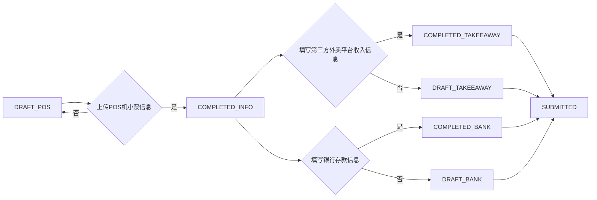
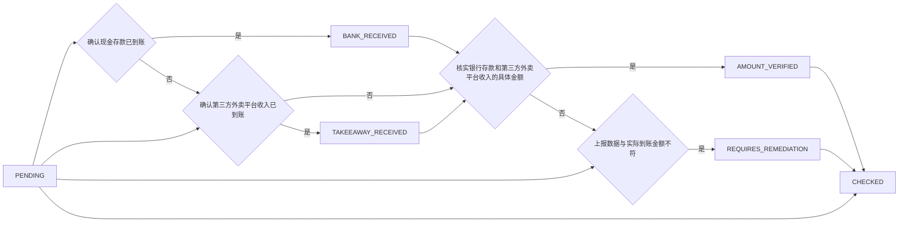

##                                                  营业额上报模块需求说明（V2.5）

> 更新时间：2024-06-21
> 状态：已确认，开发中 (MVP)

---

## 一、模块目的

为蜜雪冰城门店提供营业额上报通道，用于店员按日上报每日收入明细，供总部财务核对，形成误差记录及补缴机制，实现门店收入数据管理。 采用MVP思想，简化功能，先实现核心的上报和记录功能。

---

## 二、使用角色

*   店员：填写各类收款明细及误差信息，上报营业额，上传相关凭证。 **支持分阶段录入信息。**
*   分店长：与店员功能一致，管理店铺日常运营和数据上报。**支持分阶段录入信息。**
*   总店长：可查看所有门店销售数据，辅助管理。
*   财务人员：核对上报数据与银行实际到账是否一致（线下比对），记录误差，决定是否需要门店补缴。
*   管理员：可查看全部门店销售数据，辅助管理。   m 

---

## 三、核心业务逻辑

### 1. 店内人员上报数据

*   店员和分店长可逐步填写每日收入和误差信息，允许分阶段录入和提交数据。 所有金额单位为泰铢。
*   店员和分店长需要分阶段上传以下信息：

    *   **第一步：POS机小票信息 (必须包含POS机小票照片)**

        *   POS现金收入 (C)
        *   POS电子支付收入 (P)
        *   POS外卖收入 (D)
        *   代金券使用金额 (R)
        *   POS现金收入误差 (A)
        *   POS电子支付误差 (B)
        *   **POS机小票照片（必传）**

    *   **第二步：第三方外卖平台收入信息**

        *   第三方外卖收入金额 (Q2)
        *   第三方外卖平台收入凭证

    *   **第三步：录入银行存款信息：**

        *   银行存入的现金金额
        *   存款手续费
        *   银行存款凭证

    **说明：第一步必须先做，第二步和第三步不分先后顺序**

*   **文件上传：**

    *   支持图片（jpg, png, gif）和 PDF 文件
    *   应在前端校验文件类型和大小（最大 5MB）。
    *   应支持使用手机相机直接拍照上传
    *   上传的文件存储路径应包含：用户ID，店铺ID，时间戳等信息。

*   **公式和校验**

    *   **POS机小票总收入(T) =  C + P + D**
        *   T： POS机小票总收入，单位：泰铢
        *   C： 现金收入，单位：泰铢
        *   P： 电子支付收入，单位：泰铢
        *   D： POS系统中记录的外卖收入，单位：泰铢
    *   在 **POS机小票信息阶段** 提交时，系统会自动校验 `total_income = cash_sales + electronic_sales + system_takeaway_sales`，如果不等，给出明确提示。

*   提交完成之后，如果需要更新信息，需要按照流程逐步上传，每个tab页上传完成之后才可以点击下一步

### 2. 系统自动计算

*   系统自动计算：
    *   店铺实际营业额 (actual\_sales) = 实际到账金额 (bank\_deposit) + 代金券使用金额 (voucher\_amount)。

### 3. 财务复核

*   财务人员 *线下* 将银行实收数据与门店上报比对。
*   **实际到账金额 (bank\_deposit)：** 由财务人员根据实际情况填写，单位：泰铢。是银行实际收到的金额。
*   **店铺实际营业额 (actual\_sales):** 系统自动计算，单位：泰铢。 计算公式： `actual_sales = bank_deposit + voucher_amount`

*   财务核账人员可以查看所有上报的误差，误差会被记录到店铺实际营业额中。
*   只有超出预设限额的误差，才需要门店补交。 是否需要补交由财务核账人员最终决定。 财务人员可以上传附件说明原因。
*   财务人员可标记某记录为 "需要补交", "已核对" 等状态, 并在附件中上传备注说明.

---

## 四、名词解释

### POS机小票总收入(T)

*   POS机打印小票上的总收入，计算公式：现金收入(C) + 电子支付收入(P) + POS系统中记录的外卖收入(D)，单位：泰铢

### 实际到账金额 (bank\_deposit)

*   财务人员 *线下* 根据银行流水等信息，最终确认的到账金额。 是银行实际收到的金额，单位：泰铢

### 店铺实际营业额 (actual\_sales)

*   实际到账金额 + 代金券使用金额，单位：泰铢

---

## 五、技术架构要求

**1. 后端**

*   **编程语言:** Python (3.8+)
*   **Web框架:** Flask (3.1+)
*   **ORM:** SQLAlchemy (2.0+)
*   **数据库:**
    *   MySQL (5.7+)
    *   使用 Alembic 进行数据库迁移管理。
*   **认证与授权:**
    *   使用 Flask-Login 进行用户认证和会话管理。
    *   使用 Werkzeug security 实现密码哈希存储。
*   **文件存储：**
    *   支持图片（jpg, png, gif）和 PDF 文件上传。
    *   使用 UUID 作为文件名，避免文件名冲突。
    *   文件存储到本地磁盘。
    *   文件存储路径：`/uploads/user_id/store_id/report_date/filename.ext`
*   **安全性：**
    *   防止 SQL 注入：使用 SQLAlchemy ORM 操作数据库，避免手动拼接 SQL 语句。
    *   防止 XSS 攻击：使用 Jinja2 模板引擎，自动转义特殊字符。
    *   防止 CSRF 攻击：使用 Flask-WTF 提供的 CSRF 保护。
    *   密码安全：使用 Werkzeug security 的 `generate_password_hash` 函数进行密码哈希存储。
*   **日志：**
    *   使用 Python logging 模块记录系统日志。
    *   日志级别：INFO, WARNING, ERROR
    *   日志输出到文件：`/var/log/sales.log`
*   **错误处理：**
    *   统一的错误处理机制，记录错误信息，并返回友好的错误提示。

**2. 前端**

*   **技术选型：**
    *   HTML5 / CSS3 / JavaScript
    *   Bootstrap 5
    *   jQuery
*   **页面要求：**
    *   兼容 PC 端和移动端（响应式设计）。
    *   页面美观、简洁、易于操作。
    *   提供清晰的表单验证提示。
    *   支持拖拽上传、截图粘贴、手机拍照上传文件。
    *   异步提交表单（AJAX），避免页面刷新。
*   **文件上传：**
    *   前端校验文件类型和大小（最大 5MB）。
    *   上传进度条显示。
    *   上传成功后，预览文件。

*   **用户交互**
    *   使用 Javascript代码在POS机小票Tab里自动计算POS总收入.
    *   根据后端传递的 `report_status` 动态控制页面的显示效果和元素可用性。
*   **关键页面：**

    *   **首页 (`main/index.html`)**
    *   **营业信息上报页面 (`sales/report.html`)**

        *   POS机小票信息 Tab
        *   第三方外卖平台信息 Tab
        *   银行存款信息 Tab
    *   **销售核对页面 (`sales/list.html`)**
    *   **用户 Profile 页面 (`user/profile.html`)**

**3. 编码规范**

*   遵循 PEP8 编码规范
*   添加代码注释，特别是对复杂逻辑的说明

**4. 测试**

*   编写单元测试， 测试主要模型类， 确保每个函数都能正常运行
*   编写集成测试， 测试主要功能， 保证整个业务流程没有问题
*   进行代码审查，提高代码质量

---

## 六、前端页面逻辑说明

### 页面结构目录

```
app/templates/
├── base.html                # 公共模板（导航栏、基础布局）
├── main/
│   └── index.html           # 首页模板
├── sales/
│   └── report.html          # 营业信息上报页面
│   └── list.html            # 销售核对页面
└── user/
    └── profile.html       # 用户 profile 页面
```

### 首页（main/index.html）

*   路由：`main.index`
*   展示内容：

    *   系统欢迎语与操作引导
    *   当前登录用户所属店铺信息（如为店员/分店长）或所有店铺列表（如为总店长/管理员/财务）
        *   **店员/分店长：** 显示所属店铺的ID和名称
        *   **总店长/管理员/财务：** 显示所有店铺的ID和名称
    *   最近一次归档的日营业额（按日期倒序取最新）
        *   **日期：** 显示最近一次归档的日期 (YYYY-MM-DD)
        *   **营业额：** 显示该店铺在该日的实际营业额（单位：泰铢）
        *   如果没有数据， 显示`暂无数据`
    *   当月累计营业额（当前月所有上报已归档记录总和）
        *   **营业额：** 显示该店铺当月累计的实际营业额 （单位：泰铢）
        *   如果没有数据， 显示`0`

*   用户权限判断逻辑：
    *   使用 `current_user.role` 判断角色
    *   若为普通店员/分店长，则限定展示所属 `store_id` 数据
    *   若为总店长/管理员/财务角色，则汇总所有门店数据

### 营业信息上报页面（sales/report.html）

1.  **分阶段录入：** 页面分为三个 Tab 页，对应 POS 机小票信息、第三方外卖平台收入信息、银行存款信息。

2.  **Tab页状态控制：**

    *   默认显示 POS 机小票信息 Tab 页。
    *   只有在完成了 POS 机小票信息的录入和提交后，才允许访问第三方外卖平台收入信息 Tab 页。
    *   只有在完成了第三方外卖平台收入信息的录入和提交后，才允许访问银行存款信息 Tab 页。

3.  **Tab页标签状态显示：** 在每个Tab页标签上根据对应的 `report_status`  显示`草稿`或者`完成`状态, 参见[上报状态流转](#report-status-上报状态流转)

4.  **数据录入与展示：**

    *   从后端获取 `DailySales` 对象，并将数据填充到表单中。
    *   如果当前用户已经填写了部分信息，则自动加载这些信息并显示在对应的 Tab 页中。

5.  **POS机小票信息阶段：**

    *   需要自动计算 POS机小票总收入(T)，并在页面上展示: T = 现金收入(C) + 电子支付收入(P) + POS系统中记录的外卖收入(D)
    *   **POS机小票照片作为首次提交时的必传附件。**
    *   需要校验：`total_income = cash_sales + electronic_sales + system_takeaway_sales`，如果不等，给出明确提示。

6.  **数据提交：**

    *   点击每个 Tab 页上的“保存”按钮，将当前 Tab 页的数据提交到后端。
    *   只有在所有 Tab 页都填写完成后，才显示“提交所有信息”按钮。
    *   需要对各种错误情况进行处理，例如：
        *   文件类型不正确
        *   文件大小超过限制
        *   数据校验失败

7.  **文件上传：**

    *   支持图片（jpg, png, gif）和 PDF 文件
    *   应在前端校验文件类型和大小（最大 5MB）。
    *   应支持使用手机相机直接拍照上传

### 销售核对页面（sales/list.html）

*   权限控制：仅管理员/财务可访问，店员/分店长无权限
*   展示内容：所有门店的上报记录，按日期排序，显示各项收入（单位：泰铢）、误差（单位：泰铢）、POS机小票总收入(T)（单位：泰铢）、财务填写的实际到账金额(bank\_deposit)（单位：泰铢）、计算后的店铺实际营业额(actual\_sales)（单位：泰铢）、上传时间、以及附件信息（POS机小票，外卖平台信息，银行存款信息），是否需要补交，是否已核对。
*   展示附件上传信息： 需要区分POS小票附件、外卖平台附件和银行存款附件
*   财务人员可以：
    *   添加附件说明原因。
    *   填写实际到账金额 (bank\_deposit)。
    *   标记某条记录为 "需要补交" 或 "已核对" 等状态。

---

## 七、用户角色与权限

### 用户角色

*   `admin` (管理员): 拥有所有权限。
*   `head_manager` (总店长): 可以查看所有店铺的数据。
*   `finance` (财务): 可以查看和修改所有店铺的财务数据。
*   `branch_manager` (分店长): 只能查看和修改自己所属店铺的数据。
*   `employee` (店员): 只能查看和修改自己所属店铺的数据。

### 权限控制

*   **登录验证：** 在用户登录时，检查 `User` 表中的 `user_status` 字段。如果 `user_status` 为 0，则拒绝登录。
*   **首页 (`main/index.html`):**
    *   **店员/分店长：** 显示所属店铺的信息。
    *   **总店长/管理员/财务：** 显示所有店铺的信息。
*   **销售核对页面 (`sales/list.html`):**
    *   **店员/分店长：** 无权限访问。
    *   **管理员/财务：** 可以访问所有店铺的核对信息。
*   **营业信息上报页面 (`sales/report.html`):**
    *   所有角色都可以访问，但只能修改自己所属店铺的数据。

---

## 八、Report状态流转

### 上报状态流转

#### `ReportStatus` (上报状态)

*   `DRAFT_POS`： 已保存POS机小票信息草稿
*   `DRAFT_TAKEAWAY`： 已保存第三方外卖平台收入信息草稿
*   `DRAFT_BANK`： 已保存银行存款信息草稿
*   `COMPLETED_INFO`： 营业信息已完成上传 (POS机小票信息已上传)
*   `COMPLETED_BANK`： 现金存款凭证已上传
*   `COMPLETED_TAKEEAWAY`： 第三方外卖平台销售信息已完成上传
*   `SUBMITTED`: 已提交

1.  **初始状态：`DRAFT_POS`**

    *   **描述：** 当店员/分店长创建一个新的营业额上报记录时，系统会将 `report_status` 字段设置为 `DRAFT_POS`。
    *   **含义：** 表示当前记录只保存了 POS 机小票信息草稿，还未上传 POS 机小票照片，也未完成 POS 机小票信息的提交。
    *   **触发条件：**
        *   店员/分店长点击 "创建新的营业额上报记录" 按钮。

2.  **POS 机小票信息已上传：`COMPLETED_INFO`**

    *   **描述：** 店员/分店长已经填写了 POS 机小票信息，并上传了 POS 机小票照片，点击了 "保存" 按钮。
    *   **含义：** 表示 POS 机小票信息已经录入完成，可以进行下一步操作。
    *   **触发条件：**
        *   店员/分店长填写了 POS 机小票信息，上传了 POS 机小票照片。
        *   店员/分店长点击了 "保存" 按钮。
        *   POS 机小票信息的校验通过（`total_income = cash_sales + electronic_sales + system_takeaway_sales`）。

3.  **第三方外卖平台收入信息已保存：`DRAFT_TAKEAWAY`**

    *   **描述：** 店员/分店长填写了第三方外卖平台收入信息，但尚未提交。
    *   **含义：** 表示第三方外卖平台收入信息已经录入草稿，但还未完成提交。
    *   **触发条件：**
        *   店员/分店长完成了 POS 机小票信息的上传 (`report_status` 为 `COMPLETED_INFO`)。
        *   店员/分店长填写了第三方外卖平台收入信息。
        *   店员/分店长点击了 "保存" 按钮。

4.  **第三方外卖平台收入信息已上传：`COMPLETED_TAKEEAWAY`**

    *   **描述：** 店员/分店长已经填写了第三方外卖平台收入信息，并上传了相关凭证，点击了 "保存" 按钮。
    *   **含义：** 表示第三方外卖平台收入信息已经录入完成。
    *   **触发条件：**
        *   店员/分店长完成了 POS 机小票信息的上传 (`report_status` 为 `COMPLETED_INFO`)。
        *   店员/分店长填写了第三方外卖平台收入信息。
        *   店员/分店长上传了第三方外卖平台收入凭证。
        *   店员/分店长点击了 "保存" 按钮。

5.  **银行存款信息已保存：`DRAFT_BANK`**

    *   **描述：** 店员/分店长填写了银行存款信息，但尚未提交。
    *   **含义：** 表示银行存款信息已经录入草稿，但还未完成提交。
    *   **触发条件：**
        *   店员/分店长完成了 POS 机小票信息的上传 (`report_status` 为 `COMPLETED_INFO`)。
        *   店员/分店长填写了银行存款信息。
        *   店员/分店长点击了 "保存" 按钮。

6.  **银行存款信息已上传：`COMPLETED_BANK`**

    *   **描述：** 店员/分店长已经填写了银行存款信息，并上传了银行存款凭证，点击了 "保存" 按钮。
    *   **含义：** 表示银行存款信息已经录入完成。
    *   **触发条件：**
        *   店员/分店长完成了 POS 机小票信息的上传 (`report_status` 为 `COMPLETED_INFO`)。
        *   店员/分店长填写了银行存款信息。
        *   店员/分店长上传了银行存款凭证。
        *   店员/分店长点击了 "保存" 按钮。

7.  **已提交：`SUBMITTED`**

    *   **描述：** 店员/分店长完成了所有信息的填写和凭证上传，点击了 "提交" 按钮。
    *   **含义：** 表示所有信息已经录入完成，等待财务人员审核。
    *   **触发条件：**
        *   店员/分店长完成了 POS 机小票信息、第三方外卖平台收入信息和银行存款信息的上传 (`report_status` 为 `COMPLETED_INFO`, `COMPLETED_TAKEEAWAY`, `COMPLETED_BANK` 中的一个或者多个)。
        *   店员/分店长点击了 "提交" 按钮。

#### 上报状态流转图：



### 财务核对流转

#### `FinancialCheckStatus` (财务核对状态)

*   `PENDING`： 待核对
*   `BANK_RECEIVED`： 现金存款已到账
*   `TAKEEAWAY_RECEIVED`： 第三方外卖平台收入已到账
*   `AMOUNT_VERIFIED`： 实际到账金额已核实无误
*   `REQUIRES_REMEDIATION`： 需要补交
*   `CHECKED`： 审核通过

1.  **初始状态：`PENDING`**

    *   **描述：** 当一条营业额上报记录被提交后（`report_status` 为 `SUBMITTED`），系统会将 `financial_check_status` 字段设置为 `PENDING`。
    *   **含义：** 表示该记录已提交，等待财务人员进行核对。
    *   **触发条件：**
        *   店员/分店长提交了营业额上报记录 (`report_status` 更新为 `SUBMITTED`)。

2.  **现金存款已到账：`BANK_RECEIVED`**

    *   **描述：** 财务人员确认银行已收到门店上报的现金存款。
    *   **含义：** 表示银行存款已经确认到账，但可能还需要核对具体金额或第三方外卖平台收入。
    *   **触发条件：**
        *   财务人员在销售核对页面 (`sales/list.html`) 查看了待核对的记录 (`financial_check_status` 为 `PENDING`)。
        *   财务人员通过银行流水等信息，确认银行已收到该门店的现金存款。
        *   财务人员点击 "标记现金存款已到账" 按钮。

3.  **第三方外卖平台收入已到账：`TAKEEAWAY_RECEIVED`**

    *   **描述：** 财务人员确认第三方外卖平台收入已到账。
    *   **含义：** 表示第三方外卖平台收入已经确认到账，但可能还需要核对具体金额。
    *   **触发条件：**
        *   财务人员在销售核对页面 (`sales/list.html`) 查看了待核对的记录 (`financial_check_status` 为 `PENDING` 或 `BANK_RECEIVED`)。
        *   财务人员通过第三方外卖平台对账单等信息，确认第三方外卖平台收入已到账。
        *   财务人员点击 "标记第三方外卖平台收入已到账" 按钮。

4.  **实际到账金额已核实无误：`AMOUNT_VERIFIED`**

    *   **描述：** 财务人员已经核实了银行存款和第三方外卖平台收入的具体金额，确认与门店上报的数据一致。
    *   **含义：** 表示所有收入金额都已核实无误，可以进行最终审核。
    *   **触发条件：**
        *   财务人员在销售核对页面 (`sales/list.html`) 查看了待核对的记录 (`financial_check_status` 为 `BANK_RECEIVED` 或 `TAKEEAWAY_RECEIVED`)。
        *   财务人员核对了银行存款和第三方外卖平台收入的具体金额，确认与门店上报的数据一致。
        *   财务人员点击 "标记实际到账金额已核实无误" 按钮。

5.  **需要补交：`REQUIRES_REMEDIATION`**

    *   **描述：** 财务人员发现门店上报的数据与实际到账金额不符，需要门店进行补交。
    *   **含义：** 表示门店需要进行补交，财务人员可能会在附件中说明原因。
    *   **触发条件：**
        *   财务人员在销售核对页面 (`sales/list.html`) 查看了待核对的记录 (`financial_check_status` 为 `PENDING` 或 `BANK_RECEIVED` 或 `TAKEEAWAY_RECEIVED` 或 `AMOUNT_VERIFIED`)。
        *   财务人员发现门店上报的数据与实际到账金额不符。
        *   财务人员填写了实际到账金额 (`bank_deposit`)。
        *   财务人员点击 "标记需要补交" 按钮。

6.  **审核通过：`CHECKED`**

    *   **描述：** 财务人员完成了所有核对工作，确认数据无误。
    *   **含义：** 表示该记录已经审核通过，可以进行归档或其他后续处理。
    *   **触发条件：**
        *   财务人员在销售核对页面 (`sales/list.html`) 查看了待核对的记录 (`financial_check_status` 为 `AMOUNT_VERIFIED` 或 `REQUIRES_REMEDIATION`)。
        *   财务人员确认数据无误。
        *   财务人员点击 "标记审核通过" 按钮。

#### 财务核对流转图：



## 九、数据归档

### 1. 归档说明

*   `archived` 字段用于标记营业额上报记录是否已归档。
*   归档表示该记录已经完成了所有核对工作，并且不需要再进行修改。
*   归档的记录仍然可以查看，但不能再进行编辑。

### 2. 归档状态流转

1.  **初始状态：`False`**

    *   当一条营业额上报记录被创建时，系统会将 `archived` 字段设置为 `False`。
    *   **含义：** 表示该记录尚未归档。

2.  **已归档：`True`**

    *   当财务人员完成了对一条营业额上报记录的审核，并且确认数据无误后，可以将该记录归档。
    *   **触发条件：**
        *   财务人员在销售核对页面 (`sales/list.html`) 查看了已审核通过的记录 (`financial_check_status` 为 `CHECKED`)。
        *   财务人员点击 "归档" 按钮。

### 3. 归档操作的影响

*   一旦记录被归档，店员/分店长和财务人员都不能再修改该记录的任何信息