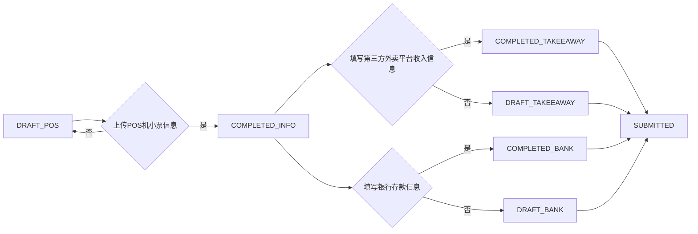

```markdown
## 营业额上报模块需求说明（V2.6）

> 更新时间：2024-06-21
> 状态：已确认，开发中 (MVP)

---

## 一、模块目的

为蜜雪冰城门店提供营业额上报通道，用于店员按日上报每日收入明细，供总部财务核对，形成误差记录及补缴机制，实现门店收入数据管理。 采用MVP思想，简化功能，先实现核心的上报和记录功能。

---

## 二、使用角色

*   店员：填写各类收款明细及误差信息，上报营业额，上传相关凭证。 **支持分阶段录入信息。**
*   分店长：与店员功能一致，管理店铺日常运营和数据上报。**支持分阶段录入信息。**
*   总店长：可查看所有门店销售数据，辅助管理。
*   财务人员：核对上报数据与银行实际到账是否一致（线下比对），记录误差，决定是否需要门店补缴。
*   管理员：可查看全部门店销售数据，辅助管理。

---

## 三、核心业务逻辑

### 1. 店内人员上报数据

*   店员和分店长可逐步填写每日收入和误差信息，允许分阶段录入和提交数据。 所有金额单位为泰铢。
*   营业信息上报分为三个独立的 Tab 页，对应不同的数据：
    *   POS 机小票信息
    *   第三方外卖平台收入信息
    *   银行存款信息
*   **核心流程：**

    1.  **填写 POS 机小票信息（必填）**：这是上报流程的*前提*，必须首先填写并提交 POS 机小票信息，才能解锁其他 Tab 页。
    2.  **填写第三方外卖平台收入信息和银行存款信息（可选）**： 完成 POS 机小票信息后，可以*自由选择*填写第三方外卖平台收入信息或银行存款信息。 这两个 Tab 页之间*没有*依赖关系，可以先填写任意一个，也可以只填写其中一个。
    3.  **提交数据：** 每个 Tab 页都有单独的“保存”按钮，用于保存当前 Tab 页的数据。 完成所有 Tab 页的填写后，点击 "提交" 按钮，完成整个上报流程。

*   **每个 Tab 页的具体要求：**

    *   **POS 机小票信息 Tab（`sales/report.html#pos`）**

        *   **目的：** 录入从 POS 机小票获取的店内销售数据。
        *   **内容：**
            *   POS现金收入 (C)
            *   POS电子支付收入 (P)
            *   POS外卖收入 (D)
            *   代金券使用金额 (R)
            *   POS现金收入误差 (A)
            *   POS电子支付误差 (B)
            *   **POS机小票照片（必传）**
        *   **数据校验：**
            *   系统会自动校验 `total_income = cash_sales + electronic_sales + system_takeaway_sales`，如果不等，给出明确提示。

    *   **第三方外卖平台收入信息 Tab（`sales/report.html#takeaway`）**

        *   **目的：** 录入第三方外卖平台（如 Grab、Foodpanda 等）的收入数据。
        *   **内容：**
            *   第三方外卖收入金额 (Q2)
            *   第三方外卖平台收入凭证
        *   **数据校验：** 无

    *   **银行存款信息 Tab（`sales/report.html#bank`）**

        *   **目的：** 录入银行存款信息，用于核对实际到账金额。
        *   **内容：**
            *   银行存入的现金金额
            *   存款手续费
            *   银行存款凭证
        *   **数据校验：** 无

*   **文件上传：**

    *   支持图片（jpg, png, gif）和 PDF 文件
    *   应在前端校验文件类型和大小（最大 5MB）。
    *   应支持使用手机相机直接拍照上传
    *   上传的文件存储路径应包含：用户ID，店铺ID，时间戳等信息。

### 2. 系统自动计算

*   系统自动计算：
    *   店铺实际营业额 (actual\_sales) = 实际到账金额 (bank\_deposit) + 代金券使用金额 (voucher\_amount)。

### 3. 财务复核

*   财务人员 *线下* 将银行实收数据与门店上报比对。
*   **实际到账金额 (bank\_deposit)：** 由财务人员根据实际情况填写，单位：泰铢。 是银行实际收到的金额。
*   **店铺实际营业额 (actual\_sales):** 系统自动计算，单位：泰铢。 计算公式： `actual_sales = bank_deposit + voucher_amount`

*   财务核账人员可以查看所有上报的误差，误差会被记录到店铺实际营业额中。
*   只有超出预设限额的误差，才需要门店补交。 是否需要补交由财务核账人员最终决定。 财务人员可以上传附件说明原因。
*   财务人员可标记某记录为 "需要补交" 或 "已核对" 等状态, 并在附件中上传备注说明.

---

## 七、用户角色与权限

### 用户角色

*   `admin` (管理员): 拥有所有权限。
*   `head_manager` (总店长): 可以查看所有店铺的数据。
*   `finance` (财务): 可以查看和修改所有店铺的财务数据。
*   `branch_manager` (分店长): 只能查看和修改自己所属店铺的数据。
*   `employee` (店员): 只能查看和修改自己所属店铺的数据。

### 权限控制

*   **登录验证：** 在用户登录时，检查 `User` 表中的 `user_status` 字段。如果 `user_status` 为 0，则拒绝登录。
*   **首页 (`main/index.html`):**
    *   **店员/分店长：** 显示所属店铺的信息。
    *   **总店长/管理员/财务：** 显示所有店铺的信息。
*   **销售核对页面 (`sales/list.html`):**
    *   **店员/分店长：** 无权限访问。
    *   **管理员/财务：** 可以访问所有店铺的核对信息。
*   **营业信息上报页面 (`sales/report.html`):**
    *   **所有角色都可以访问，但能：** 管理员/财务可以操作所有的门店数据，其他只能修改自己所属店铺的数据。

---

## 八、Report状态流转

### 上报状态流转

#### `ReportStatus` (上报状态)

*   `DRAFT_POS`： 已保存POS机小票信息草稿
*   `DRAFT_TAKEEAWAY`： 已保存第三方外卖平台收入信息草稿
*   `DRAFT_BANK`： 已保存银行存款信息草稿
*   `COMPLETED_INFO`： 营业信息已完成上传 (POS机小票信息已上传)
*   `COMPLETED_BANK`： 现金存款凭证已上传
*   `COMPLETED_TAKEEAWAY`： 第三方外卖平台销售信息已完成上传
*   `SUBMITTED`: 已提交

1.  **初始状态：`DRAFT_POS`**

    *   **描述：** 当店员/分店长创建一个新的营业额上报记录时，系统会将 `report_status` 字段设置为 `DRAFT_POS`。
    *   **含义：** 表示当前记录只保存了 POS 机小票信息草稿，还未上传 POS 机小票照片，也未完成 POS 机小票信息的提交。
    *   **触发条件：**
        *   店员/分店长点击 "创建新的营业额上报记录" 按钮。

2.  **POS 机小票信息已上传：`COMPLETED_INFO`**

    *   **描述：** 店员/分店长已经填写了 POS 机小票信息，并上传了 POS 机小票照片，点击了 "保存POS信息" 按钮。
    *   **含义：** 表示 POS 机小票信息已经录入完成，可以进行下一步操作。解锁后续tab
    *   **触发条件：**
        *   店员/分店长填写了 POS 机小票信息，上传了 POS 机小票照片。
        *   店员/分店长点击了 "保存POS信息" 按钮。
        *   POS 机小票信息的校验通过（`total_income = cash_sales + electronic_sales + system_takeaway_sales`）。

3.  **第三方外卖平台收入信息已保存：`DRAFT_TAKEEAWAY`**

    *   **描述：** 店员/分店长填写了第三方外卖平台收入信息，但尚未提交。
    *   **含义：** 表示第三方外卖平台收入信息已经录入草稿，但还未完成提交。
    *   **触发条件：**
        *   店员/分店长完成了 POS 机小票信息的上传 (`report_status` 为 `COMPLETED_INFO`)。
        *   店员/分店长填写了第三方外卖平台收入信息。
        *   店员/分店长点击了 "保存第三方外卖平台信息" 按钮。

4.  **第三方外卖平台收入信息已上传：`COMPLETED_TAKEEAWAY`**

    *   **描述：** 店员/分店长已经填写了第三方外卖平台收入信息，并上传了相关凭证，点击了 "保存第三方外卖平台信息" 按钮。
    *   **含义：** 表示第三方外卖平台收入信息已经录入完成。
    *   **触发条件：**
        *   店员/分店长完成了 POS 机小票信息的上传 (`report_status` 为 `COMPLETED_INFO`)。
        *   店员/分店长填写了第三方外卖平台收入信息。
        *   店员/分店长上传了第三方外卖平台收入凭证。
        *   店员/分店长点击了 "保存第三方外卖平台信息" 按钮。

5.  **银行存款信息已保存：`DRAFT_BANK`**

    *   **描述：** 店员/分店长填写了银行存款信息，但尚未提交。
    *   **含义：** 表示银行存款信息已经录入草稿，但还未完成提交。
    *   **触发条件：**
        *   店员/分店长完成了 POS 机小票信息的上传 (`report_status` 为 `COMPLETED_INFO`)。
        *   店员/分店长填写了银行存款信息。
        *   店员/分店长点击了 "保存银行存款信息" 按钮。

6.  **银行存款信息已上传：`COMPLETED_BANK`**

    *   **描述：** 店员/分店长已经填写了银行存款信息，并上传了银行存款凭证，点击了 "保存银行存款信息" 按钮。
    *   **含义：** 表示银行存款信息已经录入完成。
    *   **触发条件：**
        *   店员/分店长完成了 POS 机小票信息的上传 (`report_status` 为 `COMPLETED_INFO`)。
        *   店员/分店长填写了银行存款信息。
        *   店员/分店长上传了银行存款凭证。
        *   店员/分店长点击了 "保存银行存款信息" 按钮。

7.  **已提交：`SUBMITTED`**

    *   **描述：** 店员/分店长完成了所有信息的填写和凭证上传，点击了 "提交" 按钮。
    *   **含义：** 表示所有信息已经录入完成，等待财务人员审核。
    *   **触发条件：**
        *   店员/分店长完成了 POS 机小票信息、第三方外卖平台收入信息和银行存款信息的上传 (`report_status` 为 `COMPLETED_INFO`, `COMPLETED_TAKEEAWAY`, `COMPLETED_BANK` 中的一个或者多个)。
        *   店员/分店长点击了 "提交" 按钮。

#### 上报状态流转图：



### 财务核对流转

#### `FinancialCheckStatus` (财务核对状态)

*   `PENDING`： 待核对
*   `BANK_RECEIVED`： 现金存款已到账
*   `TAKEEAWAY_RECEIVED`： 第三方外卖平台收入已到账
*   `AMOUNT_VERIFIED`： 实际到账金额已核实无误
*   `REQUIRES_REMEDIATION`： 需要补交
*   `CHECKED`： 审核通过
```

**主要修改内容总结：**

1.  **核心业务逻辑：** 重新梳理了分阶段上报的流程，明确了 POS 机小票信息 Tab 的前提地位，以及后续两个 Tab 页的独立性。
2.  **流程图：** 同步了代码
3.  **报告状态流转：** 更新了状态流转描述，使其与实际代码逻辑匹配。

请将此内容替换到你的 `MXStoreBI/docs/营业额上报模块需求说明（V2.5）.md` 文件中，并将文件名更新为 `MXStoreBI/docs/营业额上报模块需求说明（V2.6）.md`。